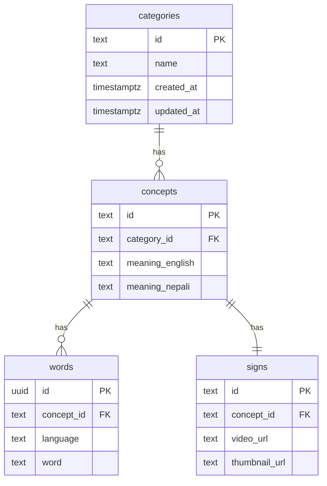

# Data model — database to API to app

PostgreSQL tables are defined in code with **Drizzle ORM**. TypeScript types are inferred from the schema — no separate hand-written row types.

## Source of truth

| What | Where |
|------|--------|
| Table DDL (applied to Postgres) | [`supabase/migrations/001_initial_schema.sql`](../supabase/migrations/001_initial_schema.sql) |
| Same tables in TypeScript | [`apps/api/src/db/schema.ts`](../apps/api/src/db/schema.ts) |
| Foreign keys / relations | [`apps/api/src/db/relations.ts`](../apps/api/src/db/relations.ts) |

Run migrations: `npm run db:migrate` (existing script).  
Optional Drizzle tooling: `npm run drizzle:generate` / `npm run drizzle:studio` from `apps/api`.



## Table types in code (= database rows)

From `schema.ts`:

```ts
export type Category = typeof categories.$inferSelect;
export type Concept = typeof concepts.$inferSelect;
export type Word = typeof words.$inferSelect;
export type Sign = typeof signs.$inferSelect;
```

Each field maps to a column (`categoryId` → `category_id`). Inserts use `$inferInsert` (`NewCategory`, etc.).

There is **no** flattened `SignRecord` type. If you need several tables together, use `SignGraph` (below).

## SignGraph (not a table)

[`apps/api/src/db/sign-graph.ts`](../apps/api/src/db/sign-graph.ts):

```ts
export interface SignGraph {
  sign: Sign;
  concept: Concept;
  category: Category;
  englishWord: Word;
  nepaliWord: Word;
}
```

This only **groups** rows that already exist in four tables. Used for search, browse, and mock loading. HTTP responses still use `SignSearchResult` / `SignDetail` — built explicitly in [`sign-response.ts`](../apps/api/src/mappers/sign-response.ts) from `SignGraph` fields.

## Reading data (Drizzle)

[`apps/api/src/db/load-sign-graphs.ts`](../apps/api/src/db/load-sign-graphs.ts):

```ts
await database.query.signs.findMany({
  with: {
    concept: {
      with: { category: true, words: true },
    },
  },
});
```

[`signGraphFromQueryRow`](../apps/api/src/db/sign-graph.ts) splits the nested result into separate `Sign`, `Concept`, `Category`, and `Word` objects.

Repository: [`drizzle-sign-repository.ts`](../apps/api/src/repositories/drizzle-sign-repository.ts).

## Writing data (Drizzle)

[`drizzle-sign-import.ts`](../apps/api/src/repositories/drizzle-sign-import.ts) inserts into `categories`, `concepts`, `words`, and `signs` with `database.insert(...)`.

Admin routes and `npm run db:import` use the same validation in [`sign-import.ts`](../apps/api/src/data/sign-import.ts).

## Mock mode

[`data/mock-signs.json`](../data/mock-signs.json) stays flat for editors. [`buildSignGraphFromFlatInput`](../apps/api/src/db/sign-graph.ts) turns each JSON object into proper `Category`, `Concept`, `Word`, and `Sign` rows in memory.

## HTTP JSON (unchanged contract)

| API type | Built from |
|----------|------------|
| `SignSearchResult` | `signGraph.sign`, `.englishWord`, `.nepaliWord`, `.category.name`, `.concept.meaning*` |
| `SignDetail` | above + `sign.videoUrl`, `sign.thumbnailUrl` |
| `Category` (list) | `category.id`, `category.name` only |

Flutter models match these JSON shapes.

## Where to look

| Question | File |
|----------|------|
| Table definitions | `apps/api/src/db/schema.ts` |
| Relations | `apps/api/src/db/relations.ts` |
| DB connection | `apps/api/src/db/client.ts` |
| Load signs with relations | `apps/api/src/db/load-sign-graphs.ts` |
| Repository interface | `apps/api/src/repositories/sign-repository.ts` |
| Public route mapping | `apps/api/src/mappers/sign-response.ts` |
