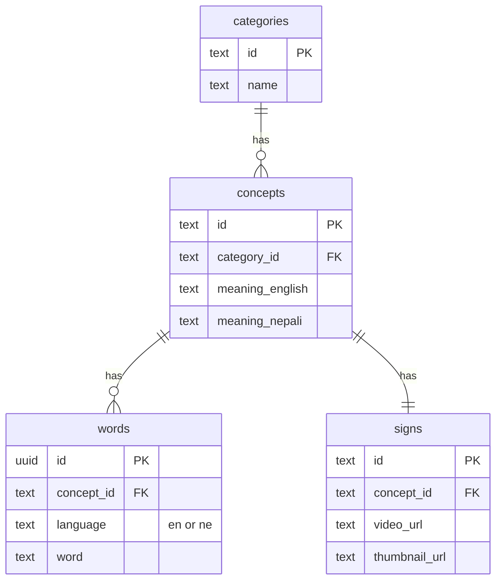

# Data model — database to API to app

How PostgreSQL tables relate to TypeScript types and Flutter models.

## Tables (what `npm run db:migrate` creates)

Defined in [`supabase/migrations/001_initial_schema.sql`](../supabase/migrations/001_initial_schema.sql).



| Table | One row means | Example |
|-------|----------------|---------|
| `categories` | A browse group | `id=family`, `name=Family` |
| `concepts` | One dictionary meaning | `id=concept-mother`, meanings in EN/NE |
| `words` | Searchable label in one language | `en` → `mother`, `ne` → `आमा` |
| `signs` | NSL video entry for that concept | `id=mother`, URLs for video/thumb |

Rules:

- Each **concept** has at most one English and one Nepali **word** (`unique (concept_id, language)`).
- Each **concept** has exactly one **sign** (`signs.concept_id` is unique).
- **`signs.id`** is the public slug the app uses (`hello`, `mother`) — not the concept id.

## Why the API does not expose four tables

Routes work with a single joined row per sign. The join lives in one place:

[`apps/api/src/repositories/postgres/postgres-row-mapper.ts`](../apps/api/src/repositories/postgres/postgres-row-mapper.ts) — `signRecordSelectSql` + `mapRowToSignRecord`.

```sql
-- Simplified: every read loads this shape
SELECT
  signs.id,
  concepts.id AS concept_id,
  english_words.word AS english_word,
  nepali_words.word AS nepali_word,
  concepts.meaning_english,
  concepts.meaning_nepali,
  categories.name AS category,
  signs.video_url,
  signs.thumbnail_url
FROM signs
JOIN concepts ...
JOIN categories ...
JOIN words english_words ... language = 'en'
JOIN words nepali_words ... language = 'ne'
```

## Type layers (API codebase)

```text
PostgreSQL (4 tables)
       │  signRecordSelectSql + mapRowToSignRecord
       ▼
SignRecord          ← internal; used in repositories & search
       │  toSignSearchResult / toSignDetail
       ▼
SignSearchResult    ← JSON for search, browse, category lists
SignDetail          ← JSON for GET /signs/:id
       │  HTTP
       ▼
Flutter models      ← SignSearchResult, SignDetail in apps/mobile
```

| Layer | File | Purpose |
|-------|------|---------|
| DB row shape | `postgres-row-mapper.ts` → `SignRecordRow` | Snake_case columns from SQL |
| App-internal | `types/sign-record.ts` → `SignRecord` | CamelCase; one object per sign |
| HTTP JSON | `types/api-responses.ts` | What clients receive |
| Mappers | `mappers/sign-response.ts` | `lang` picks one `meaning`; detail uses English meaning today |

### `SignRecord` (repository layer)

[`apps/api/src/types/sign-record.ts`](../apps/api/src/types/sign-record.ts)

| Field | DB source |
|-------|-----------|
| `id` | `signs.id` |
| `conceptId` | `concepts.id` |
| `englishWord` | `words.word` (`language = 'en'`) |
| `nepaliWord` | `words.word` (`language = 'ne'`) |
| `meaningEnglish` | `concepts.meaning_english` |
| `meaningNepali` | `concepts.meaning_nepali` |
| `category` | `categories.name` |
| `videoUrl` | `signs.video_url` |
| `thumbnailUrl` | `signs.thumbnail_url` |

You will not see `SignRecord` in HTTP responses. It exists so routes and search logic do not repeat the join.

### `SignSearchResult` (list/search JSON)

| Field | From `SignRecord` |
|-------|-------------------|
| `id` | `id` |
| `englishWord` | lowercased `englishWord` |
| `nepaliWord` | `nepaliWord` |
| `category` | `category` |
| `meaning` | `meaningEnglish` or `meaningNepali` if `lang=ne` |

`conceptId`, both meanings, and media URLs are omitted from list responses to keep payloads small.

### `SignDetail` (detail JSON)

Includes `videoUrl`, `thumbnailUrl`; `meaning` is English only for now (`toSignDetail`).

## Mock mode (no database)

[`data/mock-signs.json`](../data/mock-signs.json) is already a **flat** `SignRecord`-shaped list. `MockSignRepository` loads it directly — no SQL, no joins.

Same field names as `SignRecord` so search and routes behave the same whether `DATA_SOURCE=mock` or `postgres`.

## Writes (admin / import)

One UI/JSON row still maps to **four inserts**:

| Input field (JSON/admin) | Table.column |
|--------------------------|--------------|
| `category` (name) | `categories.name` + `categories.id` from slug |
| `conceptId` | `concepts.id` |
| `meaningEnglish` / `meaningNepali` | `concepts.meaning_*` |
| `englishWord` / `nepaliWord` | `words` (`en` / `ne`) |
| `id` (sign id) | `signs.id` |
| `videoUrl` / `thumbnailUrl` | `signs.video_url`, `signs.thumbnail_url` |

See [`postgres-sign-import.ts`](../apps/api/src/repositories/postgres-sign-import.ts).

## Flutter app

| API JSON | Dart model | File |
|----------|------------|------|
| `SignSearchResult` | `SignSearchResult` | `apps/mobile/lib/models/sign_search_result.dart` |
| `SignDetail` | `SignDetail` | `apps/mobile/lib/models/sign_detail.dart` |
| `Category` | `Category` | `apps/mobile/lib/models/category.dart` |

Flutter never sees `SignRecord` or SQL table names.

## Where to look in code

| Question | Start here |
|----------|------------|
| What tables exist? | `supabase/migrations/001_initial_schema.sql` |
| How are they joined for reads? | `postgres-row-mapper.ts` → `signRecordSelectSql` |
| How does search use words? | `sign-search-matching.ts` on `SignRecord[]` |
| What does the client get? | `sign-response.ts`, `routes/signs.ts` |
| How is a new sign saved? | `postgres-sign-import.ts`, `routes/admin.ts` |

## Related docs

- [database.md](database.md) — migrations, seeds, local setup
- [architecture.md](architecture.md) — app boundaries
